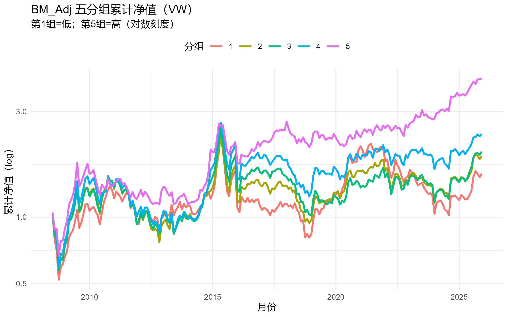
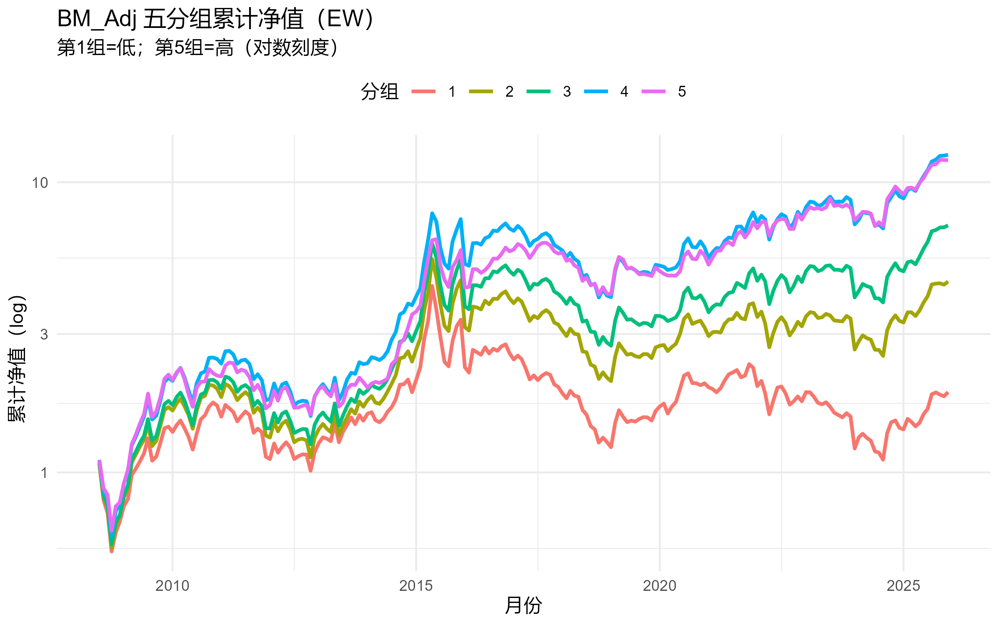
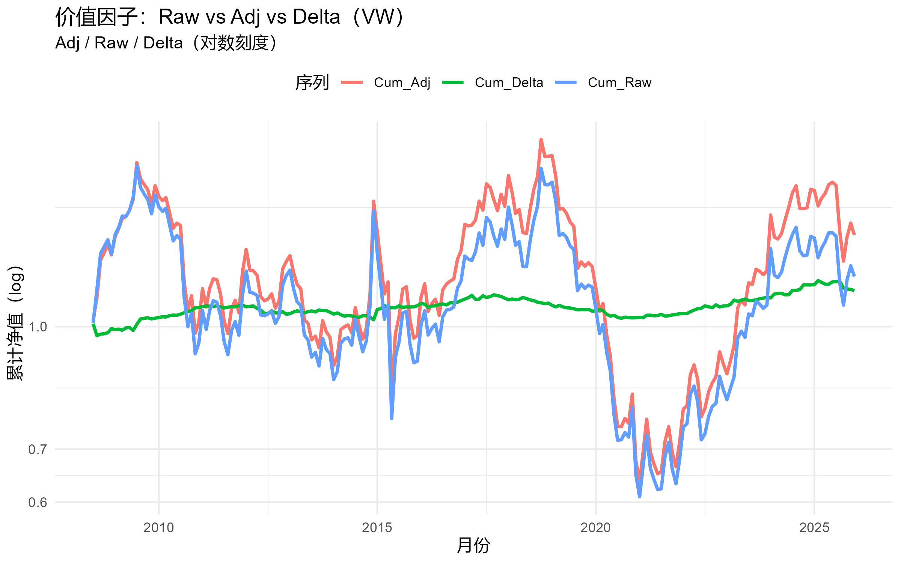
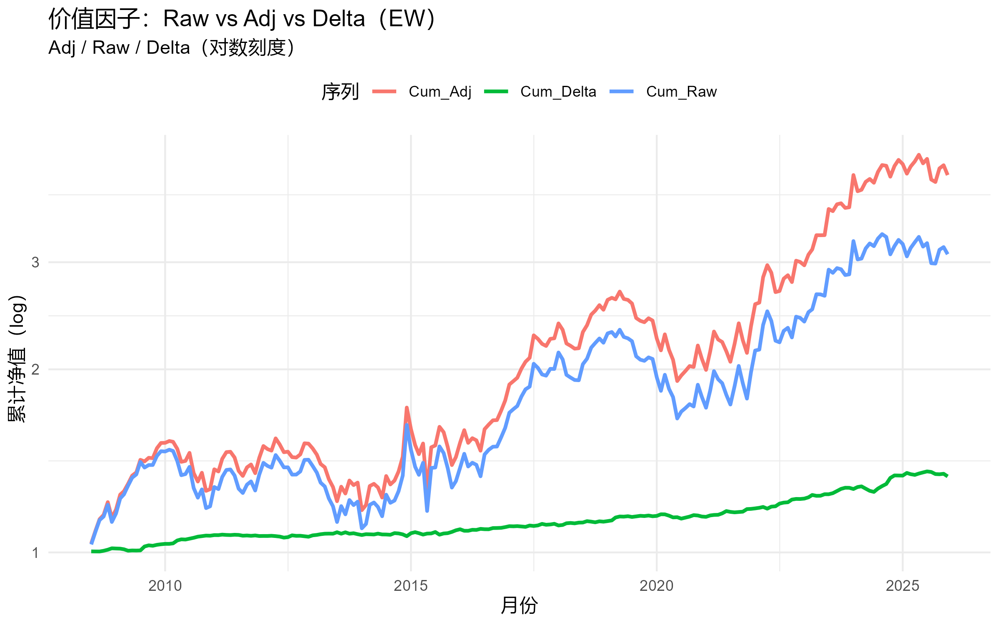

# MJY Graduation Project (R Empirical Pipeline)

This repo contains an end-to-end empirical pipeline in R:
cleaning → panel → portfolios/factors → spanning → risk-adjusted tests
→ double-sort → Fama–MacBeth → migration → robustness cuts → plots.

## Quick Start
1) Put raw data into the required folder structure (not included in this repo).
2) Run in R:
source("paper_style_annotated_pipeline.R")

Outputs will be created under:
base_path/OUTPUT_PAPER_YYYYmmdd_HHMMSS/

## Folders
- example_output/: selected figures & summary tables (for display)
- docs/: run params + R session info (for reproducibility)
- data/: instructions only (no raw data uploaded)

## Preview
### Cumulative portfolio performance

### Factor series comparison

